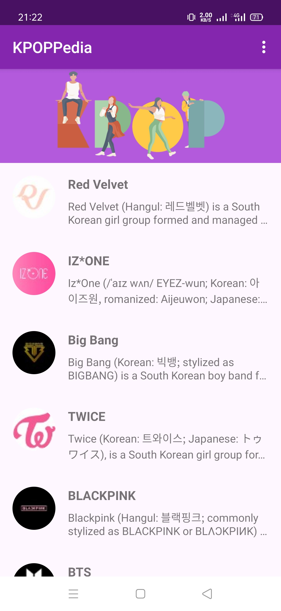
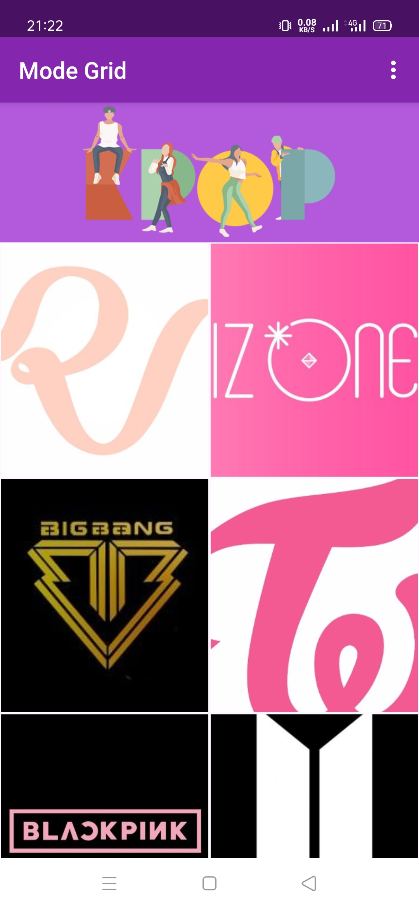
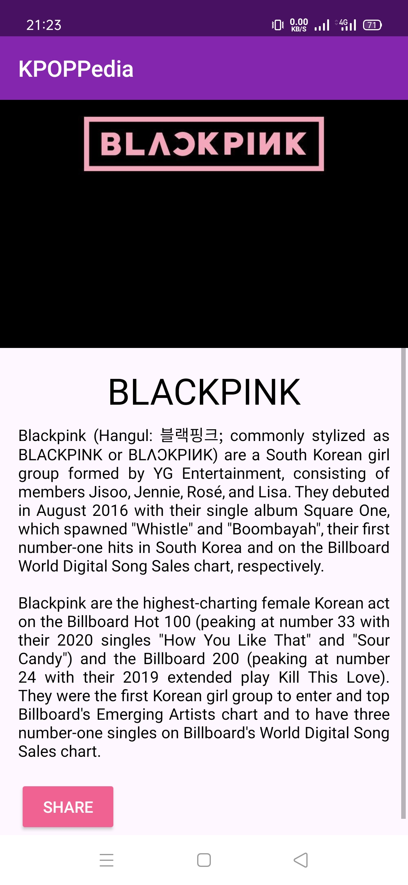

<p align="center">
  <a href="https://github.com/nicktra/kpoppedia">
    
  </a>
</p>
  
<h3 align="center">KPOPPedia</h3>

<p align="center">
    KPOPPedia is android app about KPOP Group.
    <br />
    <a href="https://github.com/nicktra/kpoppedia"><strong>Explore the docs »</strong></a>
</p>

# KPOPPedia

KPOPPedia is android app about KPOP Group.

## Getting Started

These instructions will get you a copy of the project up and running on your local machine for development and testing purposes.

### Prerequisites

Things you need to install the software and how to install them

* Android Studio (I use Android Studio 4.0.1)

### Installing

1. Clone the repo
```sh
git clone https://github.com/nicktra/footballx-pwa.git
```
2. Open with your Android Studio

## Features

* List Mode Group
* Grid Mode Group
* Detail Group
* Share Group

## Screenshots App
<pre>
          
</pre>

## Built With

* [Kotlin](https://kotlinlang.org/) - The Programming Language
* [Glide](https://github.com/bumptech/glide) is a fast and efficient open source media management and image loading framework for Android that wraps media decoding, memory and disk caching, and resource pooling into a simple and easy to use interface.
* [CircleImageView](https://github.com/hdodenhof/CircleImageView) A circular ImageView for Android.

## Contributing

Contributions are what make the open source community such an amazing place to be learn, inspire, and create. Any contributions you make are **greatly appreciated**.

1. Fork the Project
2. Create your Feature Branch (`git checkout -b feature/AmazingFeature`)
3. Commit your Changes (`git commit -m 'Add some AmazingFeature'`)
4. Push to the Branch (`git push origin feature/AmazingFeature`)
5. Open a Pull Request

## Contact

* **Konik Saputra** - [@koniksaputra](https://twitter.com/koniksaputra) - koniksaputra@live.com

## License

This project is licensed under the MIT License. See `LICENSE` for more information